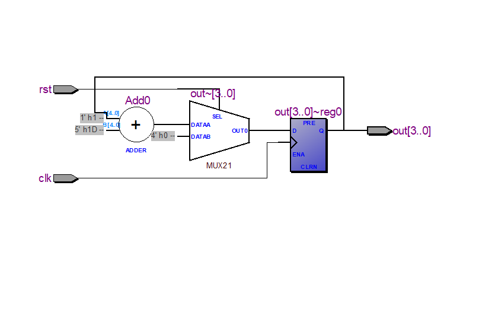

# 4-BIT-RIPPLE-COUNTER

**AIM:**

To implement  4 Bit Ripple Counter using verilog and validating their functionality using their functional tables

**SOFTWARE REQUIRED:**

Quartus prime

**THEORY**

**4 Bit Ripple Counter**

A binary ripple counter consists of a series connection of complementing flip-flops (T or JK type), with the output of each flip-flop connected to the Clock Pulse input of the next higher-order flip-flop. The flip-flop holding the least significant bit receives the incoming count pulses. The diagram of a 4-bit binary ripple counter is shown in Fig. below.


In timing diagram Q0 is changing as soon as the negative edge of clock pulse is encountered, Q1 is changing when negative edge of Q0 is encountered(because Q0 is like clock pulse for second flip flop) and so on.


**Procedure**

1.Type the program in Quartus software.

2.Compile and run the program.

3.Generate the RTL schematic and save the logic diagram.

4.Create nodes for inputs and outputs to generate the timing diagram.

5.For different input combinations generate the timing diagram.


**PROGRAM**

/* Program for 4 Bit Ripple Counter and verify its truth table in quartus using Verilog programming.
```
 Developed by:Megha s
  RegisterNumber:212224230157
 ```
 ```
  module ex12(out,clk,rst);
input clk,rst;
output reg [3:0]out;
always @ (posedge clk)
begin
   if(rst)
	   out<=0;
	else
      out<=out-1;
end
endmodule
```
*/

**RTL LOGIC FOR 4 Bit Ripple Counter**


**TIMING DIGRAMS FOR 4 Bit Ripple Counter**


**RESULTS**
```
Thus the given 4 Bit Ripple Counter are implemented using verilog and validated their functionality using functional tables are verified in Quartus II.
```

